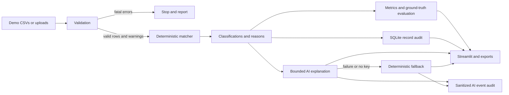

# Architecture

The validator returns fatal errors, per-row errors, and warnings. It checks cross-file references and ensures payments do not predate orders and settlements do not predate payments. The matcher never reads ground truth; evaluation uses it only when it covers exactly the reconciled IDs.

The matcher applies a documented primary precedence and retains additional evidence as secondary issues. Confidence is rule-based: `1.0` for unambiguous outcomes and `0.5` for manual review, not an ML probability.

SQLite stores one record audit per processed order and sanitized AI status events. Runtime databases are ignored. Gemini receives one structured result, returns schema-constrained JSON, and falls back locally on missing credentials, invalid output, unsafe recommendations, timeouts, quota problems, or network failure.

`src/ui.py` owns the visual system: responsive 3D depth, glass panels, motion-reduction support, escaped decision-card values, and shared Plotly styling. Keeping presentation separate from matching and auditing prevents visual changes from affecting financial classifications.
