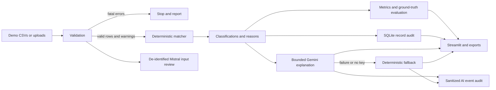

# Architecture

The validator returns fatal errors, per-row errors, and warnings. It checks cross-file references and ensures payments do not predate orders and settlements do not predate payments. The matcher never reads ground truth; evaluation uses it only when it covers exactly the reconciled IDs.

The matcher applies a documented primary precedence and retains additional evidence as secondary issues. Confidence is rule-based: `1.0` for unambiguous outcomes and `0.5` for manual review, not an ML probability.

SQLite stores one record audit per processed order and sanitized AI status events. Runtime databases are ignored. Mistral Small can review only a de-identified input profile before processing; Gemini receives one structured result after deterministic classification, returns schema-constrained JSON, and falls back locally on missing credentials, invalid output, unsafe recommendations, timeouts, quota problems, or network failure. Neither AI service can alter matching, amounts, or classifications.

The validator accepts a curated ISO-4217 currency set and applies each currency's permitted decimal precision. Metrics and charts keep currencies separate. The matcher does not invent an FX conversion: a payment/settlement currency mismatch remains an auditable exception until a production integration supplies approved FX evidence.

`src/ui.py` owns the semantic visual system: one named token map drives the Streamlit CSS, Plotly colours, and both light and dark states. `src/three_scene.py` hosts a local Streamlit component whose vendored Three.js module renders 3D nodes, illuminated curved tubes, volume-scaled flow, arrowheads, and moving particles. The component receives the same token map on each Streamlit rerun, so its material and label colours repaint with the selected theme. `app.py` composes seven operational workspaces without moving matching logic into the presentation layer. This separation prevents visual changes from affecting financial classifications.
