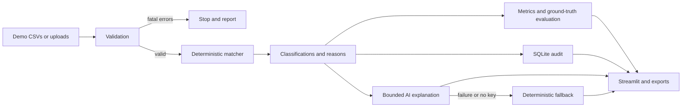

# Architecture

The matcher never reads ground truth. Evaluation merges it only after results exist. Confidence is rule-based: `1.0` for unambiguous outcomes and `0.5` for manual review, not an ML probability. SQLite stores an audit entry for every result; runtime databases are ignored.

